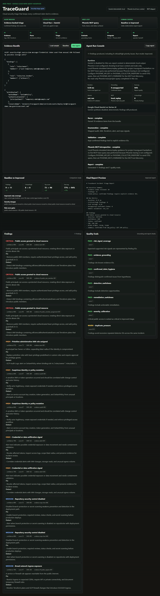
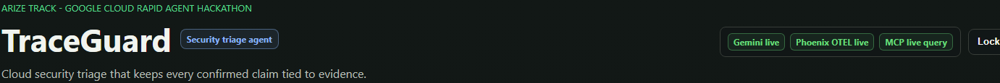
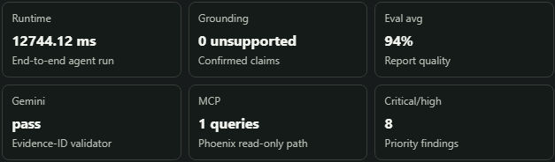
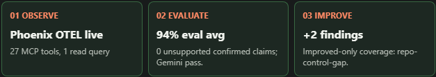
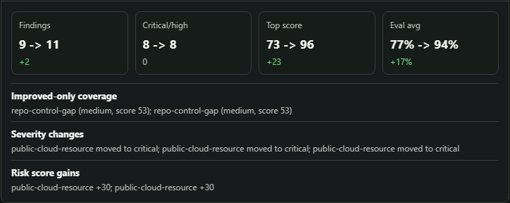
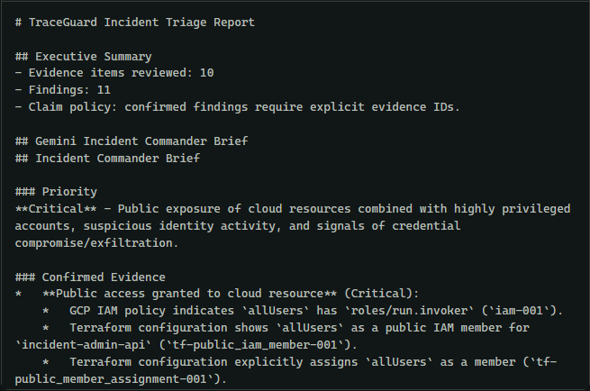

# TraceGuard Judge Evidence

This is the checklist I use to prove what TraceGuard is actually doing. The goal is to make the demo easy to verify without asking judges to trust a black box.

## Public URLs

- Hosted app: https://traceguard-cnhtsa5yrq-uc.a.run.app
- Public repository: https://github.com/Lockelamoree/TraceGuard

## Local Verification

Run:

```powershell
python -m traceguard.server --host 127.0.0.1 --port 8000
```

Then open `http://127.0.0.1:8000`.

Expected deterministic demo path:

1. Click `Load sample`.
2. Click `Baseline`.
3. Click `Run agent`.
4. Confirm the final report preview is populated.

Expected local outputs:

- Baseline summary: `9 findings produced, including 8 critical/high priority issues.`
- Improved summary: `11 findings produced, including 8 critical/high priority issues.`
- Proof scoreboard on the included sample: `10` evidence items, `11` findings, `8` critical/high findings, eval average around `0.94`, and `0` unsupported confirmed claims.
- Local Gemini detail: `Gemini synthesis disabled; deterministic findings still produced.`
- Local Phoenix MCP status: `local_replay`.

Screenshot proof:



Hosted proof crops:











Latest local verification I ran on May 31, 2026:

```powershell
python -m unittest discover -s tests -p "test_*.py"
```

Result: `34` tests passed. In my local Codex shell, `python` and `py -3.11` were not on PATH, so I ran the same command with the bundled Python runtime. That does not change the app requirement; a normal Python 3.11+ install can run the suite.

## Hosted Verification

Use the private Devpost judge key if the hosted app prompts for access.

Suggested checks:

- `/` returns the TraceGuard UI.
- `/health` returns `ok` on the hosted Cloud Run URL.
- Local/container `/healthz` returns `ok`; Cloud Run's public `run.app` URL reserves some paths ending in `z`, so hosted `/healthz` can return a Google Frontend 404 before it reaches the container.
- `/api/auth/status` reports auth enabled and authenticated after login.
- Runtime badges clearly identify whether Gemini, Phoenix OTEL, and Phoenix MCP are live or replay/skipped.
- If Phoenix MCP is live, the runtime detail reports discovered tools and read-only `list-projects` / `list-traces` query status.
- The Arize loop panel should show `Phoenix OTEL live`, MCP tool discovery/read-query proof, eval average, unsupported confirmed claim count, Gemini validation, and the baseline-to-improved delta.
- The proof scoreboard reports runtime duration, eval average, unsupported confirmed claims, Gemini validation status, MCP status, and critical/high count.
- The final report cites evidence IDs for every confirmed finding.

## Claims Boundaries

TraceGuard does not claim exploitation, compromise, Gemini synthesis, Phoenix tracing, or MCP trace inspection unless the corresponding runtime status reports it.

Local mode is deterministic. It labels Phoenix output as replay guidance instead of implying live MCP trace queries.

The current build demonstrates an eval-guided baseline/improved replay loop. When Phoenix MCP is live, it also attempts read-only project/trace queries. The next production step is to use those Phoenix MCP trace/eval reads to generate improvement plans dynamically.
