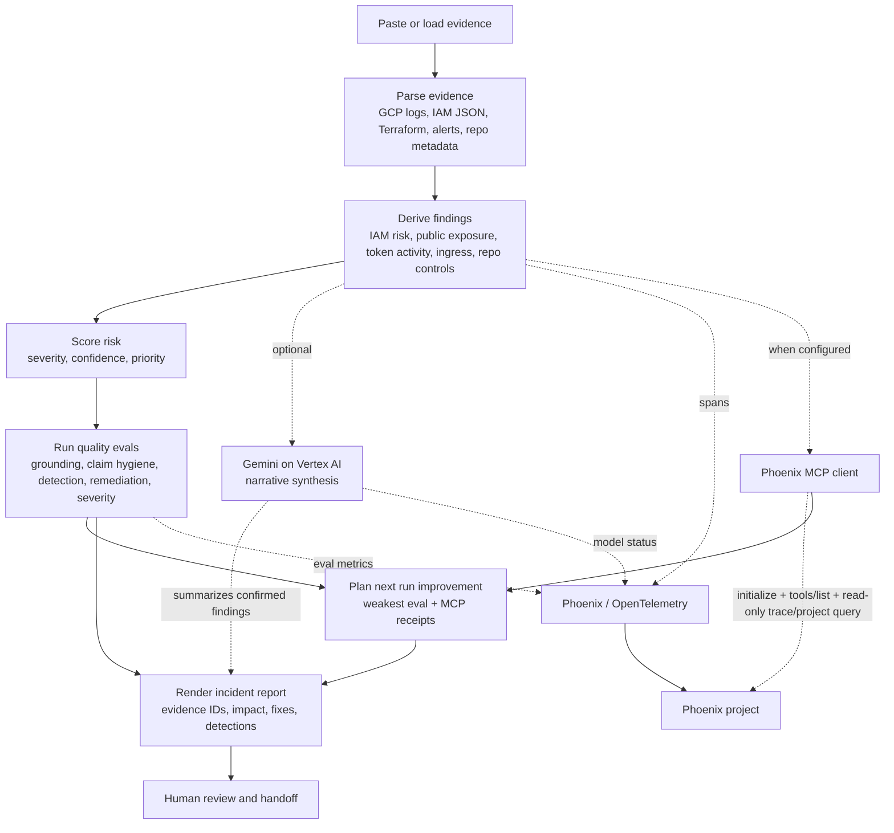
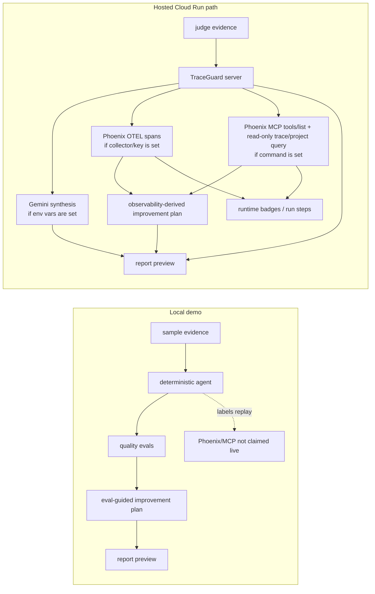

# TraceGuard Project Visualization

I use this page as the quick architecture map. It shows what runs locally, what turns on only in the hosted path, and where each tool fits.

## End-to-End Flow

## Local vs Hosted

## Tool Responsibilities

| Tool or module | What I use it for | What it does not do |
| --- | --- | --- |
| `traceguard/parsers.py` | Turns mixed evidence into structured records. | It does not infer compromise on its own. |
| `traceguard/agent.py` | Orchestrates parsing, findings, evals, Gemini, MCP, and reporting. | It does not let Gemini create findings from scratch. |
| `traceguard/evals.py` | Checks grounding, claim hygiene, detection quality, remediation quality, severity, and duplicates. | It does not replace human review. |
| `traceguard/improvement.py` | Converts the weakest eval plus Phoenix MCP read-query receipts into a next-run change. | It does not self-modify production code during a judge run. |
| `traceguard/gemini_adapter.py` | Adds optional hosted narrative synthesis through Gemini and rejects live briefs that do not cite known evidence IDs. | It is disabled locally unless Google Cloud env vars are configured, and it does not create findings. |
| `traceguard/observability.py` | Sends Phoenix/OpenTelemetry spans when configured. | It does not claim live tracing in local replay mode. |
| `traceguard/phoenix_mcp.py` | Starts a pinned Phoenix MCP command, performs `initialize` + `tools/list`, then attempts read-only `list-projects` and `list-traces`. | It does not expose secrets or mutate Phoenix data. |
| `traceguard/report.py` | Produces the markdown incident report. | It does not remove evidence IDs from confirmed findings. |
| `web/` | Gives judges and reviewers a small UI for loading evidence, running baseline/improved, checking the proof scoreboard, and copying the report. | It is not a SIEM replacement. |

## Current Boundary

The current build demonstrates an eval-guided baseline/improved loop, read-only Phoenix MCP trace/project querying when Phoenix is live, and an improvement planner that turns those receipts into a concrete next-run change. It uses observability and eval outputs directly, but it does not claim autonomous production self-modification.
