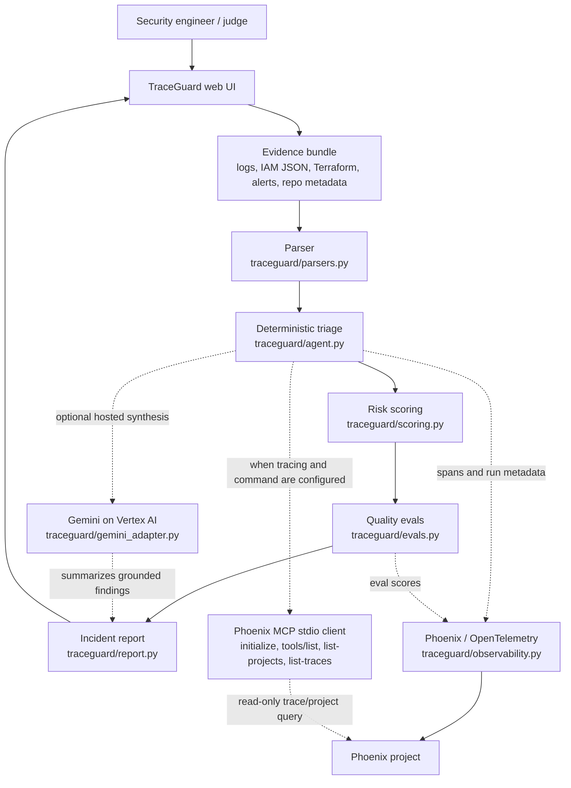

# TraceGuard

I built TraceGuard for the Arize track of the Google Cloud Rapid Agent Hackathon. The idea is simple: a cloud incident report should not sound confident unless the evidence backs it up.

TraceGuard takes a mixed evidence bundle - GCP audit logs, IAM policy JSON, Terraform snippets, alert text, and repository metadata - and turns it into a grounded security triage report. It calls out confirmed findings, confidence, impact, remediation, detection ideas, CWE references, and MITRE ATT&CK mappings. If the evidence is weak, it says so instead of manufacturing a clean bill of health.

The local version is intentionally easy to run. The hosted version is wired for the hackathon path: Cloud Run, optional Gemini synthesis through Vertex AI, Phoenix/OpenTelemetry spans, and a pinned Phoenix MCP command for read-only runtime introspection.

## Judge Quickstart

Public project URL: https://traceguard-cnhtsa5yrq-uc.a.run.app

Public repository URL: https://github.com/Lockelamoree/TraceGuard

## Judge Proof in 60 Seconds

If I only had one minute with a judge, I would show this path:

1. Open the hosted app and unlock it with the Devpost judge key.
2. Click `Load sample`, then `Run agent`.
3. Check the proof scoreboard in the run console:
   - Findings: 11 on the deterministic sample.
   - Critical/high findings: 8.
   - Eval average: about 94% locally on the sample bundle.
   - Unsupported confirmed claims: 0.
   - Gemini validation: `pass` only when a live Gemini brief cites known evidence IDs; `not_run` when Gemini is disabled.
   - Phoenix MCP: `ok`, `discovery_only`, `local_replay`, or the exact skipped/error state.
4. Open the final report preview and spot-check that every confirmed finding cites evidence IDs such as `iam-001`, `audit-003`, or `repo-line-065`.

That is the point of the project: the UI should make the evidence boundary visible without asking anyone to trust a black box. Local mode is still useful, but it is not dressed up as live Gemini or live Phoenix. Management may ask for military-grade encryption; TraceGuard asks for receipts.


Run locally:

```powershell
python -m traceguard.server --host 127.0.0.1 --port 8000
```

Open `http://127.0.0.1:8000`, click `Load sample`, then click `Run agent`.

Expected local output:

- Baseline: 9 findings, including 8 critical/high priority issues.
- Improved: 11 findings, including 8 critical/high priority issues.
- Improved-only coverage: `repo-control-gap`.
- Severity change: public access findings move from high to critical.
- Proof scoreboard: 0 unsupported confirmed claims and about 94% eval average on the included sample bundle.
- Local runtime status: Gemini is disabled unless Google Cloud env vars are set; Phoenix/MCP show local replay unless Phoenix env vars are set.

For the hosted demo, use the Devpost judge access key. After login, the runtime badges should make it clear whether Gemini, Phoenix OTEL, and Phoenix MCP are live or skipped/replay.

Hosted liveness uses `/health` or `/api/auth/status`. The container also exposes `/healthz`, but Google Cloud Run reserves some public URL paths ending in `z`, so the exact hosted `/healthz` path can return a Google Frontend 404 before the request reaches TraceGuard.

## Workflow Map

This is the project at a glance. The important bit is that deterministic security logic produces the findings first; Gemini can summarize those findings, but it is not allowed to invent them.



I keep the full map in [PROJECT_VISUALIZATION.md](PROJECT_VISUALIZATION.md), including the local-vs-hosted split.

## Claims Matrix

| Claim | Local deterministic demo | Hosted production path | Notes |
| --- | --- | --- | --- |
| Evidence parsing and deterministic findings | Confirmed | Confirmed after authenticated run | No cloud credentials required locally. |
| Baseline vs improved delta | Confirmed | Confirmed after authenticated run | This build uses deterministic eval-guided replay, not autonomous online learning. |
| Gemini synthesis | Disabled by default | Requires `GOOGLE_CLOUD_PROJECT` and `ENABLE_GEMINI_SYNTHESIS=true` | Gemini summarizes deterministic findings; it does not create security facts. |
| Phoenix OTEL tracing | Local replay by default | Requires `PHOENIX_API_KEY` or `PHOENIX_COLLECTOR_ENDPOINT` | Runtime badges distinguish live tracing from replay. |
| Phoenix MCP integration | Local replay by default | Requires live tracing and `PHOENIX_MCP_COMMAND` | The live MCP path verifies `initialize` and `tools/list`, then attempts read-only `list-projects` and `list-traces` queries. |
| Public repo and license | This repository | This repository | MIT license included. |

## Why I Built It This Way

- **Beyond chat:** The app parses evidence, runs security checks, scores findings, runs evals, and renders a report a human can use.
- **Google Cloud path:** The web app is Cloud Run-ready. The code also exposes an ADK-compatible `root_agent` for Agent Platform work.
- **Arize path:** I added Phoenix/OpenTelemetry hooks, runtime badges, a pinned Phoenix MCP stdio client, and evals that check whether the report is grounded.
- **Security workflow:** The point is not to replace a security engineer. It is to stop the report from mixing confirmed evidence with confident guesses.
- **Honest demo boundary:** Local mode is deterministic and says when Gemini or Phoenix are not live. Nobody needs another dashboard-shaped illusion at 3am.

## Run Locally

Requires Python 3.11 or newer. No third-party packages are required for the local deterministic demo.

```powershell
python -m traceguard.server --host 127.0.0.1 --port 8000
```

On Windows, if `python` is not on PATH but the Python launcher is installed:

```powershell
py -3.11 -m traceguard.server --host 127.0.0.1 --port 8000
```

Open `http://127.0.0.1:8000`, load the sample bundle, and run both `Baseline` and `Run agent`.

## Test

```powershell
python -m unittest discover -s tests -p "test_*.py"
```

Windows launcher equivalent:

```powershell
py -3.11 -m unittest discover -s tests -p "test_*.py"
```

## Demo Script

1. Start the app and load the sample incident bundle.
2. Run `Baseline` to show the first pass. It catches IAM risk, public exposure, suspicious token activity, broad ingress, and alert text.
3. Run `Run agent` to show the improved pass. The delta should add `repo-control-gap` and promote public access risk.
4. Walk through a few findings:
   - Public Cloud Run invoker binding.
   - Primitive `roles/owner` assignment.
   - Suspicious `SetIamPolicy` and `GenerateAccessToken`.
   - Broad `0.0.0.0/0` ingress.
   - Disabled branch protection and secret scanning.
5. Open the report preview or copy the final report. Each confirmed claim should cite evidence IDs.

## Cloud Run Deployment Shape

Production Python dependencies are pinned in `requirements-production.txt` and installed by the Dockerfile. The image also installs Node/npm so the pinned Phoenix MCP command can run through `npx`, then drops to a non-root `traceguard` user. The container runs:

```powershell
python -m traceguard.server --host 0.0.0.0 --port 8080
```

Production environment variables:

- `GOOGLE_CLOUD_PROJECT`: Google Cloud project for the hosted deployment.
- `GOOGLE_CLOUD_LOCATION`: Vertex AI location, defaults to `global` locally and `us-central1` in the deploy script.
- `GOOGLE_GENAI_USE_VERTEXAI=True`: Routes the Google Gen AI SDK through Vertex AI.
- `ENABLE_GEMINI_SYNTHESIS=true`: Enables Gemini report synthesis after deterministic findings are produced.
- `GEMINI_MODEL`: Gemini model name, defaults to `gemini-2.5-flash`.
- `PHOENIX_API_KEY`: Enables Phoenix Cloud tracing. Store this in Secret Manager.
- `PHOENIX_BASE_URL`: Phoenix API base URL for MCP, defaults to `https://app.phoenix.arize.com`.
- `PHOENIX_COLLECTOR_ENDPOINT`: Phoenix collector endpoint or Phoenix Cloud space URL.
- `PHOENIX_CLIENT_HEADERS`: Optional Phoenix client headers. If this is absent and `PHOENIX_API_KEY` is present, TraceGuard derives `api_key=<key>` at runtime for older Phoenix Cloud spaces without printing the key.
- `PHOENIX_PROJECT_NAME`: Phoenix project name, defaults to `traceguard-hackathon`.
- `PHOENIX_MCP_SERVER`: MCP server command/name, defaults to `@arizeai/phoenix-mcp`.
- `PHOENIX_MCP_COMMAND`: Optional stdio command used for live read-only MCP introspection. The production image preinstalls `@arizeai/phoenix-mcp@4.0.13`, so `phoenix-mcp` is the preferred Cloud Run value.
- `PHOENIX_MCP_TIMEOUT_SECONDS`: Timeout for MCP initialize, tool discovery, and read-only trace/project queries, defaults to 4 seconds locally and 12 seconds in deploy scripts.
- `TRACEGUARD_AUTH_TOKEN`: Shared access key required before sample data, runtime config, or agent runs are available. Store this in Secret Manager.
- `TRACEGUARD_AUTH_SESSION_SECONDS`: Signed browser session lifetime, defaults to 12 hours.

Create the production secrets:

```powershell
gcloud secrets create traceguard-phoenix-api-key --data-file=-
gcloud secrets create traceguard-auth-token --data-file=-
```

If you use the Dockerized gcloud helper, generate and upload a random TraceGuard access key:

```powershell
powershell.exe -ExecutionPolicy Bypass -File .\deploy\set-auth-secret.ps1 `
  -ProjectId "your-gcp-project-id" `
  -Generate
```

Deploy to Cloud Run from a locally verified build:

```powershell
powershell.exe -ExecutionPolicy Bypass -File .\deploy\image-cloud-run.ps1 `
  -ProjectId "your-gcp-project-id" `
  -Region "us-central1" `
  -PhoenixCollectorEndpoint "https://app.phoenix.arize.com/s/your-space-name"
```

Both `deploy\cloud-run.ps1` and `deploy\image-cloud-run.ps1` run `deploy\local-verify.ps1` before touching Cloud Run. The gate builds the container locally, runs the test suite inside that image, starts it on `127.0.0.1`, checks `/health`, confirms the judge proof UI/JS markers are present, and posts the sample bundle to `/api/analyze`. Production deploy stops if any of those checks fail.

If Google Cloud SDK is not installed locally, use the full production wizard. It uses the Cloud SDK container, stores auth in `.gcloud/`, prompts for the Phoenix key locally, writes it to Secret Manager, and deploys Cloud Run:

```powershell
powershell.exe -ExecutionPolicy Bypass -File .\deploy\full-production.ps1
```

For lower-level gcloud commands through Docker:

```powershell
powershell.exe -ExecutionPolicy Bypass -File .\deploy\docker-gcloud.ps1 auth login --no-launch-browser
```

The deploy script enables required APIs, creates a least-privilege runtime service account, grants Vertex AI access, grants Secret Manager access only to the Phoenix secret, and deploys Cloud Run with `PHOENIX_API_KEY` mounted from Secret Manager.

It also mounts `TRACEGUARD_AUTH_TOKEN` from Secret Manager. Cloud Run remains unauthenticated at the platform layer so judges can reach the URL, but TraceGuard requires the access key before running the agent or reading demo evidence.

## Arize / Phoenix Integration Notes

The production tracing path lives in `traceguard/observability.py`. When `PHOENIX_API_KEY` or `PHOENIX_COLLECTOR_ENDPOINT` is configured, TraceGuard registers Phoenix OTEL tracing and emits spans for parsing, finding derivation, evals, Gemini synthesis, Phoenix MCP introspection, and report generation.

The spans include run mode, evidence count/kinds, finding IDs/severities, eval scores/statuses, Gemini status, MCP status/tool count, and report length. Without Phoenix configuration, the app labels the output as local replay guidance instead of claiming live MCP trace queries.

The live MCP path lives in `traceguard/phoenix_mcp.py`. When OTEL tracing is live and `PHOENIX_MCP_COMMAND` is configured, TraceGuard launches the Phoenix MCP server over stdio, sends a JSON-RPC `initialize`, performs `tools/list`, then attempts read-only Phoenix data queries through `list-projects` and `list-traces` when those tools are exposed. The API and UI report the MCP result as `ok`, `discovery_only`, `command_not_configured`, `tracing_not_ready`, `error`, or `local_replay`. The public runtime endpoint exposes only whether a command is configured, not the command value.

For the hosted Cloud Run demo, the Docker image preinstalls the pinned MCP package. Use:

```powershell
PHOENIX_BASE_URL=https://app.phoenix.arize.com
PHOENIX_COLLECTOR_ENDPOINT=https://app.phoenix.arize.com/s/your-space-name
PHOENIX_MCP_COMMAND="phoenix-mcp"
PHOENIX_MCP_TIMEOUT_SECONDS=12
```

For local experiments without installing the package globally, `npx -y @arizeai/phoenix-mcp@4.0.13` is still allowed. Keep `PHOENIX_API_KEY` in Secret Manager or the runtime environment instead of putting it in the command line. For defense in depth, TraceGuard rejects unpinned `npx @arizeai/phoenix-mcp@latest` commands and only allows the official pinned Phoenix MCP package or an installed `phoenix-mcp` executable.

Expected production instrumentation:

- Instrument Gemini calls with Phoenix/OpenInference-compatible OpenTelemetry.
- Export traces to Phoenix Cloud.
- Configure `PHOENIX_MCP_COMMAND` so the app can launch `@arizeai/phoenix-mcp`, verify available Phoenix tools with `tools/list`, and query read-only project/trace data when supported.
- Run evals for evidence grounding, confirmed-claim hygiene, detection usefulness, remediation usefulness, severity calibration, and duplicate pressure.

## Google Agent Builder / ADK Runtime Surface

The deployed judge UI is a Cloud Run web runtime because it is easy to verify and keeps the security workflow inspectable. The agent surface for Google ADK / Agent Platform lives beside it in `traceguard/adk_agent.py`.

That file exposes `root_agent`, a Google ADK `Agent` when `google-adk` is installed. The ADK agent uses Gemini as its model and has one mandatory tool: `triage_evidence_tool`. The tool runs the same deterministic parser, scoring, and eval pipeline used by the web app. The instruction tells Gemini to call the tool before making security claims, so Agent Builder/ADK orchestration can use Gemini without letting it invent findings.

The web app uses `traceguard/agent.py` for HTTP orchestration. For Google ADK or Agent Platform workflows, `traceguard/adk_agent.py` exposes:

- `root_agent`: Google ADK agent object when `google-adk` is installed.
- `triage_evidence_tool`: deterministic parser/scoring/eval tool used by the ADK agent.

In the demo, I describe this as two entry points over the same core agent logic: Cloud Run for the hosted judge experience, and ADK `root_agent` for Google Agent Builder / Agent Platform orchestration.

## Repository Contents

- `traceguard/agent.py`: Triage orchestration and finding derivation.
- `traceguard/phoenix_mcp.py`: Optional stdio MCP client for read-only Phoenix tool discovery.
- `traceguard/parsers.py`: Structured evidence parsing.
- `traceguard/evals.py`: Quality evals for grounded reporting.
- `traceguard/report.py`: Markdown incident report renderer.
- `traceguard/server.py`: Dependency-free web server.
- `web/`: Browser UI.
- `samples/gcp_incident_bundle.txt`: Safe synthetic incident scenario.
- `tests/`: Unit and scenario tests.

## Safety Model

TraceGuard does not claim exploitation or compromise without evidence. Findings are marked confirmed only when backed by parsed evidence IDs. Empty or malformed evidence returns inconclusive results, not a fake clean bill of health.

The hosted app has an app-level auth gate. When `TRACEGUARD_AUTH_TOKEN` is configured, the server denies `/sample`, `/api/runtime`, and `/api/analyze` until the browser presents a signed HttpOnly session cookie. The login screen is convenience; the backend check is the actual control.

Repeated bad access-key attempts receive `429` responses, and authenticated `/api/analyze` requests reject cross-origin `Origin` / `Referer` values. For a long-lived production service, I would put Cloud Run behind IAM, IAP, or Cloud Armor instead of relying only on a shared demo key.
