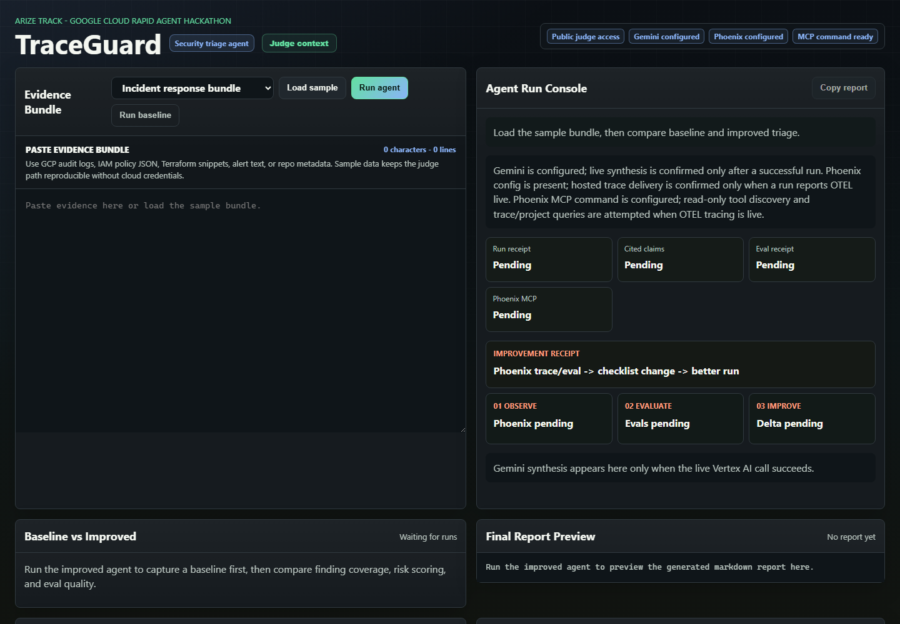
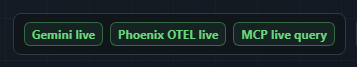
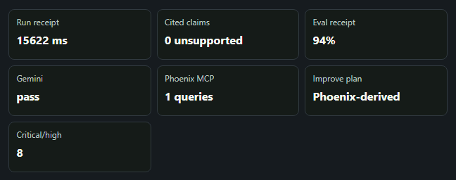
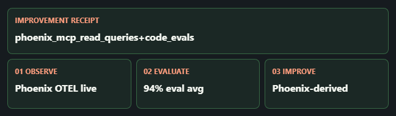
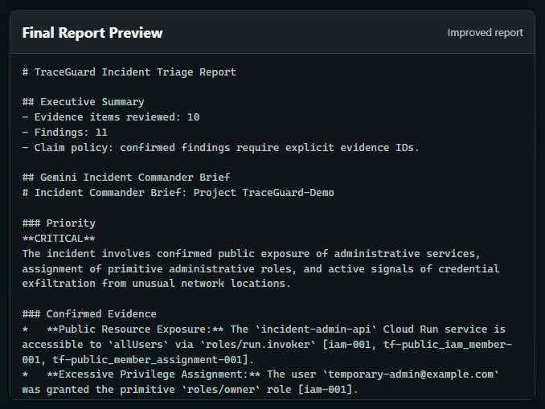
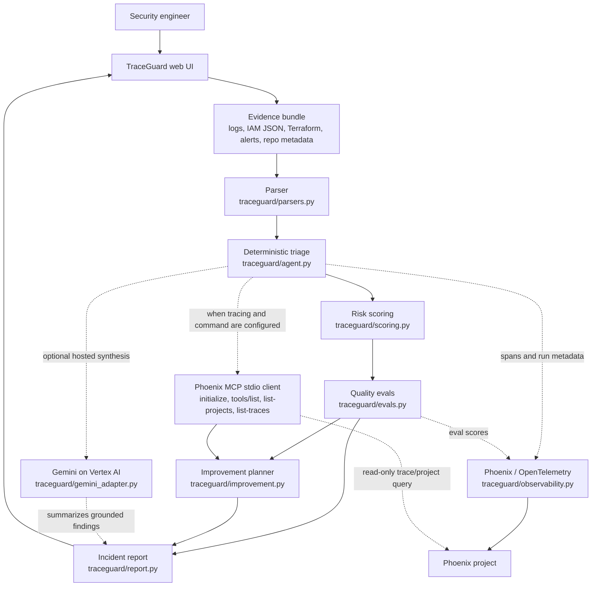

# TraceGuard

## Why I Built This

After a cloud incident, the hard part is not usually one missing log line. It is turning scattered evidence into a report that a security lead can trust quickly enough to act.

The sample incident I use for TraceGuard looks like a real GCP cleanup problem: a Cloud Run service is publicly invokable through `allUsers`, a `temporary-admin@example.com` account has `roles/owner`, audit logs show suspicious token and IAM policy activity, Terraform leaves broad ingress open, and repo metadata says branch protection and secret scanning are disabled. Any one of those signals can be noisy. Together, they need evidence-backed triage, not a confident summary that forgets where its claims came from.

TraceGuard's gain is speed plus accountability. It takes a mixed evidence bundle - GCP audit logs, IAM policy JSON, Terraform snippets, alert text, and repository metadata - and turns it into a grounded security triage report with confirmed findings, confidence, impact, remediation, detection ideas, CWE references, and MITRE ATT&CK mappings. If the evidence is weak, it says so instead of manufacturing a clean bill of health.

I built TraceGuard for the Arize track of the Google Cloud Rapid Agent Hackathon. The local version is intentionally easy to run. The hosted version is wired for Cloud Run, Gemini synthesis through Vertex AI, Phoenix/OpenTelemetry spans, and a pinned Phoenix MCP command for read-only runtime introspection.

## Project Links

Public project URL: https://traceguard-cnhtsa5yrq-uc.a.run.app

Public repository URL: https://github.com/Lockelamoree/TraceGuard

Public proof endpoint: https://traceguard-cnhtsa5yrq-uc.a.run.app/proof

## Proof Snapshot

The UI makes the evidence boundary visible without asking anyone to trust a black box. Local mode stays deterministic and labels Gemini or Phoenix as disabled/replay unless those integrations are actually configured. The hosted Cloud Run build is public for judging, includes selectable sample bundles plus a guarded custom sample upload path, and shows live runtime receipts for Gemini, Phoenix OTEL, Phoenix MCP, eval quality, and unsupported confirmed claims.



Hosted Gemini 3 proof crops from the deployed Cloud Run build:









Sanitized live deployment proof is captured in [docs/hosted-live-proof.md](docs/hosted-live-proof.md). The hosted app also exposes a public, non-secret `/proof` JSON receipt for automated checks, including a sanitized `latest_run` receipt with Gemini validation, Phoenix MCP status, eval average, and unsupported-claim count. The compact judge-context receipt in the UI starts neutral and is populated from `/proof` or the current run result, so those values are runtime evidence, not hardcoded copy.

Hosted liveness uses `/health` or `/api/auth/status`. The container also exposes `/healthz`, but Google Cloud Run reserves some public URL paths ending in `z`, so the exact hosted `/healthz` path can return a Google Frontend 404 before the request reaches TraceGuard.

## Workflow Map

This is the project at a glance. The important bit is that deterministic security logic produces the findings first; Gemini can summarize those findings, but it is not allowed to invent them.



I keep the full map in [PROJECT_VISUALIZATION.md](PROJECT_VISUALIZATION.md), including the local-vs-hosted split.

## Claims Matrix

| Claim | Local deterministic run | Hosted production path | Notes |
| --- | --- | --- | --- |
| Evidence parsing and deterministic findings | Confirmed | Confirmed after hosted public run | No cloud credentials required locally. |
| Baseline vs improved delta | Confirmed | Confirmed after hosted public run | This build uses deterministic eval-guided replay, not autonomous online learning. |
| Observability improvement plan | Eval-guided local plan | `observability_derived` when Phoenix MCP read queries complete | The plan cites eval and MCP receipts, then proposes the next run change. It does not self-modify production code. |
| Gemini synthesis | Disabled by default | Requires `GOOGLE_CLOUD_PROJECT` and `ENABLE_GEMINI_SYNTHESIS=true` | Gemini summarizes deterministic findings; it does not create security facts. |
| Phoenix OTEL tracing | Local replay by default | Requires `PHOENIX_API_KEY` or `PHOENIX_COLLECTOR_ENDPOINT` | Runtime badges distinguish live tracing from replay. |
| Phoenix MCP integration | Local replay by default | Requires live tracing and `PHOENIX_MCP_COMMAND` | The live MCP path verifies `initialize` and `tools/list`, then attempts read-only `list-projects` and `list-traces` queries. |
| ADK / Agent Platform surface | Importable when `google-adk` is installed | Same core triage logic exposed through `traceguard/adk_agent.py` | Cloud Run is the hosted UI; `root_agent` is the Agent Builder / ADK surface. |
| Public repo and license | This repository | This repository | MIT license included. |

## Why I Built It This Way

- **Beyond chat:** The app parses evidence, runs security checks, scores findings, runs evals, and renders a report a human can use.
- **Google Cloud path:** The hosted app is deployed on Cloud Run, and the repo exposes an ADK-compatible `root_agent` for Agent Builder / Agent Platform workflows over the same parser/scoring/eval core.
- **Arize path:** TraceGuard runs code evals that check whether the report is grounded. Phoenix/OpenTelemetry observes each run, Phoenix MCP provides read-only trace/project receipts, and the improvement planner turns the weakest eval plus MCP receipts into a next-run change.
- **Security workflow:** The point is not to replace a security engineer. It is to stop the report from mixing confirmed evidence with confident guesses.
- **Honest runtime boundary:** Local mode is deterministic and says when Gemini or Phoenix are not live. Nobody needs another dashboard-shaped illusion at 3am.

## Run Locally

Requires Python 3.11 or newer. No third-party packages are required for the local deterministic run.

```powershell
python -m traceguard.server --host 127.0.0.1 --port 8000
```

On Windows, if `python` is not on PATH but the Python launcher is installed:

```powershell
py -3.11 -m traceguard.server --host 127.0.0.1 --port 8000
```

Open `http://127.0.0.1:8000`, choose a sample bundle, and run both `Baseline` and `Run agent`.

You can also click `Upload sample` to load a custom text evidence bundle into the same textarea. The upload is browser-local and non-persistent: TraceGuard validates the file before reading it into the evidence box, and the backend only receives the text if you later run the agent. Accepted sample types are text/log/JSON/JSONL/NDJSON/Terraform/YAML/Markdown files under 1 MB. The UI rejects empty files, invalid UTF-8, binary/control-heavy content, unexpected file extensions or MIME types, and likely secrets such as private keys, Google API keys, AWS access keys, GitHub tokens, or long credential assignments. Redact real secrets before analysis anyway; client-side checks are a guardrail, not a full DLP system.

Expected sample result:

- Baseline: 9 findings, including 8 critical/high priority issues.
- Improved: 11 findings, including 8 critical/high priority issues.
- Improved-only coverage: `repo-control-gap`.
- Severity change: public access findings move from high to critical.
- Proof scoreboard: 0 unsupported confirmed claims and about 94% eval average on the included sample bundle, calculated from TraceGuard's deterministic quality evals.
- Improvement plan: local runs use code eval receipts to recommend the next checklist/reporting change; hosted runs can show `observability_derived` when Phoenix MCP read queries complete.
- Local runtime status: Gemini is disabled unless Google Cloud env vars are set; Phoenix/MCP show local replay unless Phoenix env vars are set.

## Test

```powershell
python -m unittest discover -s tests -p "test_*.py"
```

Windows launcher equivalent:

```powershell
py -3.11 -m unittest discover -s tests -p "test_*.py"
```

## Cloud Run Deployment Shape

Production Python dependencies are pinned in `requirements-production.txt` and installed by the Dockerfile. The image also installs Node/npm so the pinned Phoenix MCP command can run through `npx`, then drops to a non-root `traceguard` user. The container runs:

```powershell
python -m traceguard.server --host 0.0.0.0 --port 8080
```

Production environment variables:

- `GOOGLE_CLOUD_PROJECT`: Google Cloud project for the hosted deployment.
- `GOOGLE_CLOUD_LOCATION`: Vertex AI location, defaults to `global` locally and `us-central1` in the deploy script.
- `GOOGLE_GENAI_USE_VERTEXAI=True`: Routes the Google Gen AI SDK through Vertex AI.
- `ENABLE_GEMINI_SYNTHESIS=true`: Enables Gemini report synthesis after deterministic findings are produced.
- `GEMINI_MODEL`: Gemini model name, defaults to `gemini-3-flash-preview`.
- `PHOENIX_API_KEY`: Enables Phoenix Cloud tracing. Store this in Secret Manager.
- `PHOENIX_BASE_URL`: Phoenix API base URL for MCP, defaults to `https://app.phoenix.arize.com`.
- `PHOENIX_COLLECTOR_ENDPOINT`: Phoenix collector endpoint or Phoenix Cloud space URL.
- `PHOENIX_CLIENT_HEADERS`: Optional Phoenix client headers. If this is absent and `PHOENIX_API_KEY` is present, TraceGuard derives `api_key=<key>` at runtime for older Phoenix Cloud spaces without printing the key.
- `PHOENIX_PROJECT_NAME`: Phoenix project name, defaults to `traceguard-hackathon`.
- `PHOENIX_MCP_SERVER`: MCP server command/name, defaults to `@arizeai/phoenix-mcp`.
- `PHOENIX_MCP_COMMAND`: Optional stdio command used for live read-only MCP introspection. The production image preinstalls `@arizeai/phoenix-mcp@4.0.13`, so `phoenix-mcp` is the preferred Cloud Run value.
- `PHOENIX_MCP_TIMEOUT_SECONDS`: Timeout for MCP initialize, tool discovery, and read-only trace/project queries, defaults to 4 seconds locally and 12 seconds in deploy scripts.
- `TRACEGUARD_REQUIRE_AUTH`: Optional fail-closed auth guard. The public judging deploy leaves this unset/false so reviewers can open the app without an access key.
- `TRACEGUARD_AUTH_TOKEN`: Optional shared access key used only when `TRACEGUARD_REQUIRE_AUTH=true`. Store it in Secret Manager for protected deployments.
- `TRACEGUARD_AUTH_SESSION_SECONDS`: Signed browser session lifetime, defaults to 12 hours.

Create the production Phoenix secret:

```powershell
gcloud secrets create traceguard-phoenix-api-key --data-file=-
```

For a private deployment, generate and upload a random TraceGuard access key, then deploy with `-RequireAuth`:

```powershell
powershell.exe -ExecutionPolicy Bypass -File .\deploy\set-auth-secret.ps1 `
  -ProjectId "your-gcp-project-id" `
  -Generate
```

Deploy to Cloud Run from a locally verified build:

```powershell
powershell.exe -ExecutionPolicy Bypass -File .\deploy\image-cloud-run.ps1 `
  -ProjectId "your-gcp-project-id" `
  -Region "us-central1" `
  -PhoenixCollectorEndpoint "https://app.phoenix.arize.com/s/your-space-name"
```

Both `deploy\cloud-run.ps1` and `deploy\image-cloud-run.ps1` run `deploy\local-verify.ps1` before touching Cloud Run. The gate builds the container locally, runs the test suite inside that image, starts it on `127.0.0.1` with auth required, checks `/health`, confirms the proof UI/JS markers are present, logs in with a local verification token, and posts the sample bundle to `/api/analyze`. Production deploy stops if any of those checks fail. The hosted judging deploy itself is public unless `-RequireAuth` is passed.

The production deploy scripts also preserve an existing Cloud Run `PHOENIX_COLLECTOR_ENDPOINT` when the flag is omitted, reject the generic `https://app.phoenix.arize.com` root endpoint, and require a Phoenix space-specific URL such as `https://app.phoenix.arize.com/s/your-space-name` for new production deploys.

If Google Cloud SDK is not installed locally, use the full production wizard. It uses the Cloud SDK container, stores auth in `.gcloud/`, preserves existing secrets by default, prompts only when a secret is missing or you choose to rotate it, and deploys Cloud Run:

```powershell
powershell.exe -ExecutionPolicy Bypass -File .\deploy\full-production.ps1
```

For lower-level gcloud commands through Docker:

```powershell
powershell.exe -ExecutionPolicy Bypass -File .\deploy\docker-gcloud.ps1 auth login --no-launch-browser
```

The deploy script enables required APIs, creates a least-privilege runtime service account, grants Vertex AI access, grants Secret Manager access to the Phoenix secret, and deploys Cloud Run with `PHOENIX_API_KEY` mounted from Secret Manager.

When `-RequireAuth` is passed, it also mounts `TRACEGUARD_AUTH_TOKEN` from Secret Manager and requires a signed browser session before sample data, runtime config, or agent runs are available.

## Arize / Phoenix Integration Notes

The production tracing path lives in `traceguard/observability.py`. When `PHOENIX_API_KEY` or `PHOENIX_COLLECTOR_ENDPOINT` is configured, TraceGuard registers Phoenix OTEL tracing and emits spans for parsing, finding derivation, TraceGuard code evals, Gemini synthesis, Phoenix MCP introspection, improvement planning, and report generation.

The spans include run mode, evidence count/kinds, finding IDs/severities, eval scores/statuses, Gemini status, MCP status/tool count, improvement-plan source/status, and report length. Without Phoenix configuration, the app labels the output as local replay guidance instead of claiming live MCP trace queries.

The live MCP path lives in `traceguard/phoenix_mcp.py`. When OTEL tracing is live and `PHOENIX_MCP_COMMAND` is configured, TraceGuard launches the Phoenix MCP server over stdio, sends a JSON-RPC `initialize`, performs `tools/list`, then attempts read-only Phoenix data queries through `list-projects` and `list-traces` when those tools are exposed. The API and UI report the MCP result as `ok`, `discovery_only`, `command_not_configured`, `tracing_not_ready`, `error`, or `local_replay`. The public runtime endpoint exposes only whether a command is configured, not the command value.

In the UI, the Arize improvement loop is shown as `Observe -> Evaluate -> Improve`: Phoenix/OpenTelemetry observes the run, Phoenix MCP provides read-only trace/project receipts, TraceGuard code evals show grounding quality, and `traceguard/improvement.py` converts the weakest eval plus MCP read-query receipts into a next-run improvement. Local mode falls back to `eval_guided_local`; hosted mode can report `observability_derived` when Phoenix MCP completes read-only `list-projects` / `list-traces` queries. This is still an honest boundary: TraceGuard recommends the next checklist/reporting change from observability receipts, but it does not self-modify production code during a hosted run.

For hosted Cloud Run, the Docker image preinstalls the pinned MCP package. Use:

```powershell
PHOENIX_BASE_URL=https://app.phoenix.arize.com
PHOENIX_COLLECTOR_ENDPOINT=https://app.phoenix.arize.com/s/your-space-name
PHOENIX_MCP_COMMAND="phoenix-mcp"
PHOENIX_MCP_TIMEOUT_SECONDS=12
```

For local experiments without installing the package globally, `npx -y @arizeai/phoenix-mcp@4.0.13` is still allowed. Keep `PHOENIX_API_KEY` in Secret Manager or the runtime environment instead of putting it in the command line. For defense in depth, TraceGuard rejects unpinned `npx @arizeai/phoenix-mcp@latest` commands and only allows the official pinned Phoenix MCP package or an installed `phoenix-mcp` executable.

Expected production instrumentation:

- Instrument Gemini calls with Phoenix/OpenInference-compatible OpenTelemetry.
- Export traces to Phoenix Cloud.
- Configure `PHOENIX_MCP_COMMAND` so the app can launch `@arizeai/phoenix-mcp`, verify available Phoenix tools with `tools/list`, and query read-only project/trace data when supported.
- Run evals for evidence grounding, confirmed-claim hygiene, detection usefulness, remediation usefulness, severity calibration, and duplicate pressure.
- Emit an improvement plan that cites the weakest eval, MCP status/query receipts, and the specific next-run change.

## Google Agent Builder / ADK Runtime Surface

The deployed hosted UI is a Cloud Run web runtime because it is easy to verify and keeps the security workflow inspectable. The agent surface for Google ADK / Agent Platform lives beside it in `traceguard/adk_agent.py`.

That file exposes `root_agent`, a Google ADK `Agent` when `google-adk` is installed. The ADK agent uses Gemini as its model and has one mandatory tool: `triage_evidence_tool`. The tool runs the same deterministic parser, scoring, and eval pipeline used by the web app. The instruction tells Gemini to call the tool before making security claims, so Agent Builder/ADK orchestration can use Gemini without letting it invent findings.

The web app uses `traceguard/agent.py` for HTTP orchestration. For Google ADK or Agent Platform workflows, `traceguard/adk_agent.py` exposes:

- `root_agent`: Google ADK agent object when `google-adk` is installed.
- `triage_evidence_tool`: deterministic parser/scoring/eval tool used by the ADK agent.

That gives two entry points over the same core agent logic: Cloud Run for the hosted web experience, and ADK `root_agent` for Google Agent Builder / Agent Platform orchestration.

## Repository Contents

- `traceguard/agent.py`: Triage orchestration and finding derivation.
- `traceguard/phoenix_mcp.py`: Optional stdio MCP client for read-only Phoenix tool discovery.
- `traceguard/parsers.py`: Structured evidence parsing.
- `traceguard/evals.py`: Quality evals for grounded reporting.
- `traceguard/report.py`: Markdown incident report renderer.
- `traceguard/server.py`: Dependency-free web server.
- `web/`: Browser UI with sample selection, guarded custom sample upload, proof scoreboard, and report preview.
- `samples/gcp_incident_bundle.txt`: Safe synthetic incident scenario.
- `samples/gcp_storage_exfil_bundle.txt`: Storage-exfiltration scenario.
- `samples/gcp_low_signal_control_bundle.txt`: Low-signal control scenario.
- `tests/`: Unit and scenario tests.

## Safety Model

TraceGuard does not claim exploitation or compromise without evidence. Findings are marked confirmed only when backed by parsed evidence IDs. Empty or malformed evidence returns inconclusive results, not a fake clean bill of health.

Custom sample upload is intentionally client-side only. Files are not stored by TraceGuard, no upload endpoint writes them to disk, and the browser must pass the local validation gate before text is copied into the evidence field. The safety gate is designed to keep obvious binary files and likely secrets out of the analysis path, while still allowing realistic redacted cloud logs, IAM JSON, Terraform, alert text, and repo metadata.

The hosted judging app is public so reviewers can run it without an access key. For private deployments, set `TRACEGUARD_REQUIRE_AUTH=true` and configure `TRACEGUARD_AUTH_TOKEN`; then the server denies `/sample`, `/api/runtime`, and `/api/analyze` until the browser presents a signed HttpOnly session cookie. The login screen is convenience; the backend check is the actual control.

Repeated bad access-key attempts receive `429` responses when auth is enabled, and `/api/analyze` requests reject cross-origin `Origin` / `Referer` values. For a long-lived production service, I would put Cloud Run behind IAM, IAP, or Cloud Armor instead of relying only on a shared access key.
