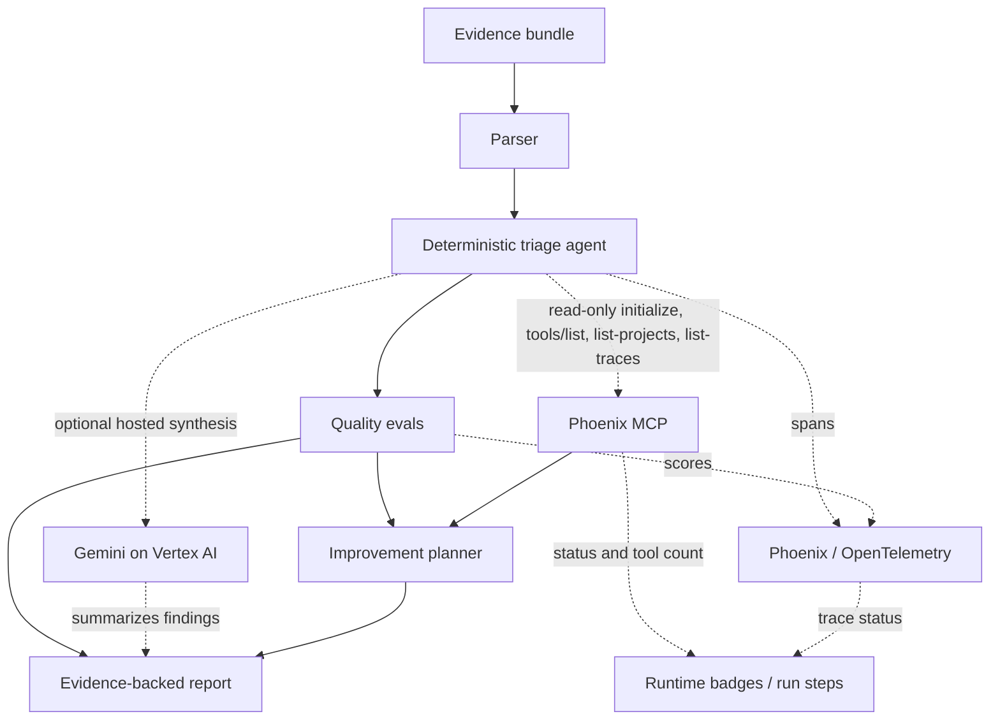

# TraceGuard Devpost Submission

## Project Summary

I built TraceGuard for the moment after a cloud incident when a security lead has logs, IAM JSON, Terraform, alert text, and repository settings scattered across five places and still needs a report they can trust. The agent reads that bundle, finds the security-relevant facts, and produces a report with evidence IDs, confidence, impact, remediation, detection ideas, CWE references, and MITRE ATT&CK mappings.

My main constraint was evidence discipline: if TraceGuard cannot back a claim with parsed evidence, it should not dress it up as confirmed. Security teams already have enough confident nonsense to clean up.

TraceGuard is my Arize track submission. The hosted path uses Cloud Run, Gemini on Vertex AI for narrative synthesis, Phoenix/OpenTelemetry spans for run visibility, a pinned Phoenix MCP command for read-only tool discovery, and TraceGuard code evals that catch unsupported or low-quality report output. The agent now turns those eval/MCP receipts into a concrete next-run improvement plan instead of leaving observability as a screenshot.

Live project URL: https://traceguard-cnhtsa5yrq-uc.a.run.app

Public repository URL: https://github.com/Lockelamoree/TraceGuard

Public proof endpoint: https://traceguard-cnhtsa5yrq-uc.a.run.app/proof

Hosted live proof: `docs/hosted-live-proof.md`

Judge access: the hosted app is public for review and no access key is required. The local run still needs no cloud credentials and shows deterministic triage, sample selection, guarded custom sample upload, baseline/improved comparison, evals, improvement planning, and report export.

## Judge Quickstart

1. Open the hosted URL or run locally.
2. Choose a sample bundle, or click `Upload sample` to use a redacted custom text bundle.
3. Click `Load sample` for a bundled sample; uploaded samples are copied into the evidence box after local safety checks.
4. Click `Run agent`.
5. Confirm the baseline/improved delta:
   - Baseline: 9 findings.
   - Improved: 11 findings.
   - Public access moves to critical.
   - Disabled branch protection and secret scanning become explicit repo-control findings.
6. Check the proof scoreboard: eval average, unsupported confirmed claims, Gemini validation, Phoenix MCP status, runtime duration, and critical/high count.
7. Check the Arize loop panel: `Observe` should show Phoenix OTEL/MCP status, `Evaluate` should show eval/grounding quality, and `Improve` should show the observability-derived next-run change.
8. Open the final report preview and check that confirmed findings cite evidence IDs.

Local command:

```powershell
python -m traceguard.server --host 127.0.0.1 --port 8000
```

Windows launcher fallback:

```powershell
py -3.11 -m traceguard.server --host 127.0.0.1 --port 8000
```

## How The Workflow Fits Together



More detail lives in `PROJECT_VISUALIZATION.md`.

## Claims Matrix

| Area | Confirmed local | Confirmed hosted public run | Optional/live-only |
| --- | --- | --- | --- |
| Deterministic triage | Yes | Yes | No |
| Baseline/improved delta | Yes | Yes | No |
| Observability improvement plan | Eval-guided local plan | Yes when runtime reports `observability_derived` | Uses eval plus MCP receipts; does not self-modify code |
| Gemini on Vertex AI | Disabled without env vars | Yes when runtime badge reports Gemini live | Requires Google Cloud project/config |
| Phoenix OTEL | Local replay without env vars | Yes when runtime badge reports Phoenix OTEL live | Requires Phoenix key/collector |
| Phoenix MCP | Local replay without env vars | Yes when runtime badge reports MCP live | Requires pinned `PHOENIX_MCP_COMMAND` |

## What It Does

- Parses mixed cloud incident evidence into structured artifacts.
- Loads bundled samples or guarded custom text samples. Custom uploads stay browser-local, must be UTF-8 text under 1 MB, and are blocked when they look binary or contain likely secrets.
- Checks for IAM over-privilege, public resource exposure, suspicious token/policy activity, broad network ingress, and disabled repo controls.
- Produces a report where every confirmed finding cites evidence IDs.
- Shows a baseline run and an improved run so the delta is visible.
- Runs evals for evidence grounding, confirmed-claim hygiene, detection usefulness, remediation usefulness, severity calibration, and duplicate pressure.
- Converts the weakest eval plus Phoenix MCP read-query receipt into a concrete next-run improvement plan.
- Shows a proof scoreboard so reviewers can see the run metrics without reading the whole report: unsupported confirmed claims, eval average, runtime duration, Gemini validation, MCP status, and critical/high count.
- Shows the Arize loop as `Observe -> Evaluate -> Improve`: TraceGuard runs the evals, Phoenix/OpenTelemetry observes the run, Phoenix MCP provides read-only trace/project receipts, and the app turns that into a specific next-run change.
- Renders the final report in-app and keeps a clipboard export for handoff.

## Hackathon Compliance Proof

- Required runtime: hosted web app on Cloud Run, with an ADK-compatible `root_agent` in `traceguard/adk_agent.py` for Google Agent Builder / Agent Platform orchestration.
- Google Cloud deployment target: Cloud Run.
- Google Cloud AI target: Gemini on Vertex AI through the Google Gen AI SDK version line required by Google ADK.
- Agent surface: ADK-compatible `root_agent` in `traceguard/adk_agent.py`.
- Arize: Phoenix Cloud, Phoenix OTEL instrumentation, a stdio Phoenix MCP client that performs read-only `initialize`, `tools/list`, `list-projects`, and `list-traces` when configured and supported by the server, plus an improvement planner that cites those receipts.
- Python standard library for the local backend.
- HTML, CSS, and JavaScript for the review-facing web app.

## Arize Integration Story

I treated observability as part of the agent loop, not a screenshot at the end. Each triage run has traceable phases: parsing, finding derivation, validation, evals, Gemini synthesis, Phoenix MCP introspection, improvement planning, and report generation.

In production mode, Phoenix/OpenTelemetry receives run metadata such as evidence mix, finding IDs/severities, TraceGuard eval scores, Gemini status, MCP status/tool count, read-only MCP query names, improvement-plan source/status, and report length. When `PHOENIX_MCP_COMMAND` is configured and OTEL is live, TraceGuard starts the Phoenix MCP server over stdio, initializes a JSON-RPC session, performs `tools/list`, then attempts read-only `list-projects` and `list-traces` queries. In local no-credential mode, the app labels the Phoenix step as replay/demo output instead of pretending live trace queries happened.

The improved run shows two levels of improvement. First, the deterministic improved checklist promotes public access from high to critical confidence and turns disabled repository controls into explicit findings instead of burying them in raw evidence. Second, `traceguard/improvement.py` reads the run's weakest eval signal and Phoenix MCP read-query receipt, then emits a next-run change such as clustering repeated findings while preserving every evidence ID. If Phoenix MCP completes read-only trace/project queries, the plan is marked `observability_derived`; otherwise it is explicitly `eval_guided_local`.

The hosted UI now makes that loop visible in one place: Phoenix/OpenTelemetry and MCP show the observability path, the TraceGuard eval tile shows grounding quality, and the improvement tile shows the next-run change. The repo also includes cropped hosted proof screenshots in `docs/screenshots/` so judges can verify the live integration without relying on one oversized capture.

I also added a small guardrail for the live Gemini brief: the narrative is shown only if it cites evidence IDs known to the deterministic run. Unsupported evidence-like references are rejected and the UI reports the validation state. The deterministic findings still remain the source of truth either way.

For hosted deployment, configure:

- `GOOGLE_CLOUD_PROJECT`
- `GOOGLE_CLOUD_LOCATION`
- `GOOGLE_GENAI_USE_VERTEXAI=True`
- `ENABLE_GEMINI_SYNTHESIS=true`
- `GEMINI_MODEL=gemini-3-flash-preview`
- `PHOENIX_API_KEY`
- `PHOENIX_BASE_URL=https://app.phoenix.arize.com`
- `PHOENIX_COLLECTOR_ENDPOINT`
- `PHOENIX_CLIENT_HEADERS` if your Phoenix Cloud space requires `api_key=...`; otherwise TraceGuard derives that header from `PHOENIX_API_KEY` at runtime.
- `PHOENIX_PROJECT_NAME=traceguard-hackathon`
- `PHOENIX_MCP_SERVER=@arizeai/phoenix-mcp`
- `PHOENIX_MCP_COMMAND=phoenix-mcp`
- `PHOENIX_MCP_TIMEOUT_SECONDS=12`

The production image preinstalls `@arizeai/phoenix-mcp@4.0.13`; local experiments can still use `npx -y @arizeai/phoenix-mcp@4.0.13`.

`PHOENIX_API_KEY` is mounted from Google Secret Manager in Cloud Run. The production image includes Node/npm for the pinned Phoenix MCP command, runs as a non-root user, and exposes `/healthz` for local/container checks plus `/health` for the hosted Cloud Run URL. Google documents some Cloud Run paths ending in `z` as reserved, so the public hosted app uses `/health` and `/api/auth/status` for external liveness. The app returns runtime status without exposing secret values or command-line values.

## Demo Video Outline

The final Devpost video should stay under three minutes.

### 0:00-0:20 Problem

After a cloud incident, the security lead gets audit logs, IAM JSON, Terraform, alerts, and repo metadata. TraceGuard turns that pile into a report where a confirmed claim is not allowed unless the source evidence backs it up.

### 0:20-1:30 Live Agent Run

Load the sample bundle. Run the baseline agent. Show findings for public Cloud Run access, primitive IAM role assignment, suspicious policy/token activity, broad ingress, and credential-exfil alert text.

### 1:30-2:20 Arize / Phoenix Loop

Run the improved agent. Show the baseline-to-improved delta panel, Phoenix/OpenTelemetry status, Phoenix MCP status, evals, and the improvement receipt. Explain that Phoenix/OTEL and MCP expose run state, code evals measure grounding, severity, and report quality, and the improvement planner turns the weakest eval plus MCP read-query receipts into a concrete next-run change. It is not claiming autonomous production self-modification. If the hosted runtime shows MCP `ok`, call out the discovered Phoenix tools, the read-only `list-projects` / `list-traces` query result, and the `observability_derived` plan status; if not, call out the exact skipped/error reason shown in the UI.

### Agent Builder / ADK proof point

Open `traceguard/adk_agent.py` in the repo. `root_agent` is the Google ADK agent surface for Agent Builder / Agent Platform orchestration. It uses Gemini and is instructed to call `triage_evidence_tool` before making claims. The hosted Cloud Run UI is the review-friendly runtime over the same deterministic parser/scoring/eval pipeline.

### 2:20-2:50 Final Report

Open the in-app report preview or copy/export the report. Point out evidence IDs, confirmed status, remediation, and detection logic. Emphasize that empty or malformed evidence is reported as inconclusive, not fake-clean.

### 2:50-3:00 Close

TraceGuard is meant to reduce cloud triage time without lowering the evidence bar. The agent does the repetitive analysis and leaves the final call with the human reviewer.

## Judge Notes

- The local app is dependency-free for reliable judging.
- The project uses synthetic evidence only; no third-party confidential data is included.
- The security model separates confirmed findings from hypotheses.
- The public repository includes an MIT license and all source needed to run the demo.
- Runtime badges distinguish live Gemini, Phoenix OTEL, and Phoenix MCP states from local deterministic replay mode.
